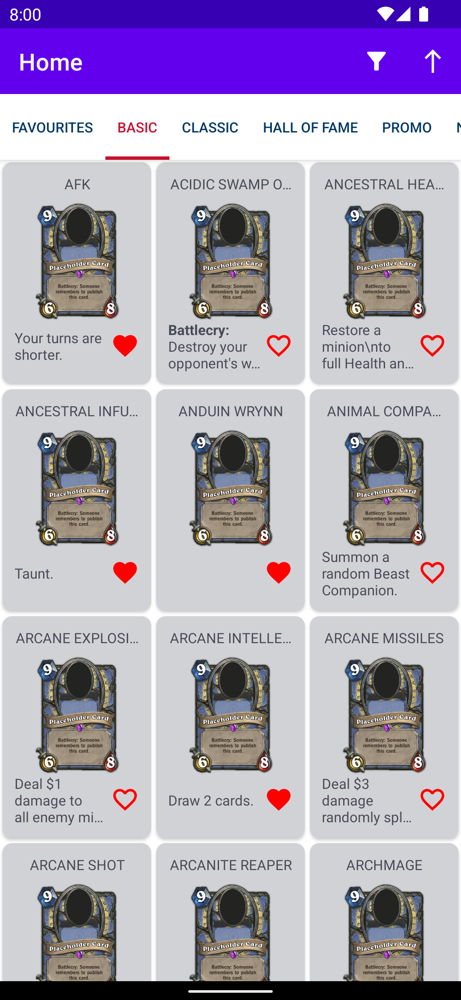
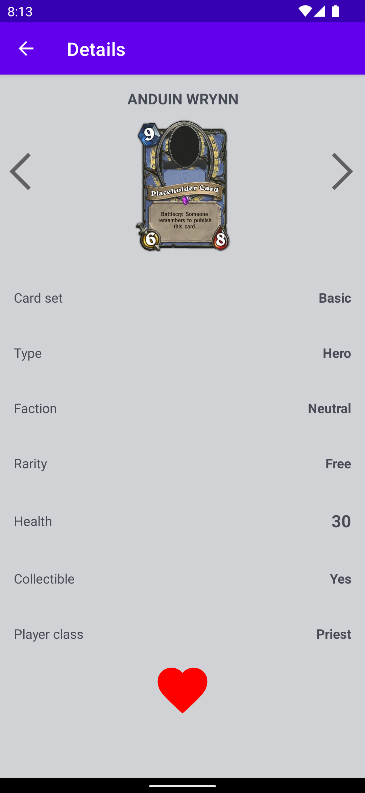
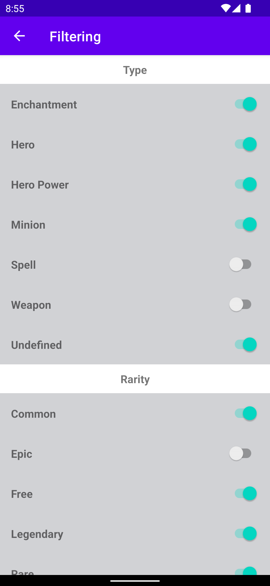
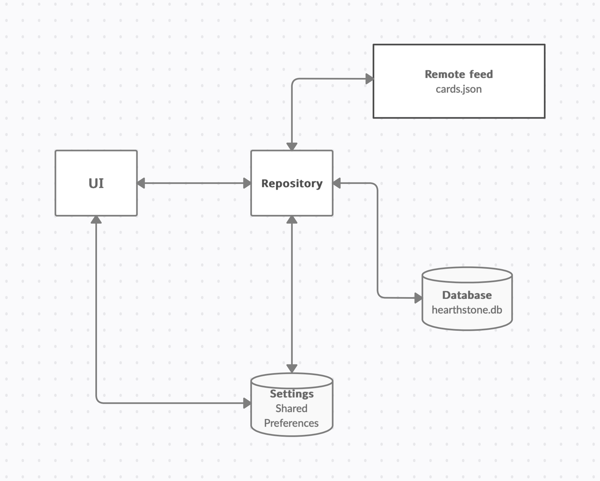

## Implementation
App architecture is MVVM, single Activity with using fragments as screens and tabs. 
Used Technologies: Kotlin, Coroutines, LiveData, Hilt, Retrofit, okhttp, Gson, Room, Jetpack navigation, View binding.

### Screens
App contains 3 screens and 1 alert dialog:
* The Home Screen with favorite tab and tabs with card sets which are based on remote feed (cards.json). Each tab contains a list of the card items. Card view has title, card's image (or placeholder if image is missing or image can't be loaded), description and favorite icon which shows current status of card and can be tapped by user to change it. User should tap on the card view item to open the Card Details Screen. Tab also has a loading indicator and a message about an empty list. Header of the screen contains the filtering and the sorting buttons. The Filtering button opens the Filtering Screen. The tap on the Sorting button changes current sorting in all tabs. The Sorting button shows the current sorting. 
* The Card Details Screen is a carousel of cards from the tab from the Home Screen with applying filters and sorting. Each page of that screen contains the card's title, image (or placeholder), full information about the card, favorite button and arrows which can be tapped to open the next or the previous page. The scrolling also can be used to open the next or the previous page. 
* The Filtering Screen has a list of filters with headers of filter's groups. Each filter item contains a label and switch which applies a new value immediately. 
* The Alert dialog which are shown if remote feed isn't available and local DB is empty (not initialised). 

### Data flow
App downloads remote json with cards and saves to the local database. Retrofit and okhttp are used for work with REST API. Gson parses json. Room is an ORM for sqlite database. App uses Shared preferences (xml) to store settings.
Build config field `BASE_HEARTHSTONE_URL` (./app/build.gradle) is used to set up base URL for remote feed.


### Swagger scheme
[heartstone-scheme.yml](./heartstone-scheme.yml) file contains description of REST API and data models in swagger format. Classes can be generated using swagger codegen. Unfortunately the swagger code generator from Homebrew doesn't contain the coroutines plugin for Kotlin so some forks of the swagger codegen can be used for generation classes according to app architecture. Also [Swagger editor](https://editor.swagger.io) can be used to quick look at swagger docs for the current REST API.

## Introduction

Hsiao here at Splendo is a very enthusiastic casual Hearthstone player. He is also a user of the KLM houses apps ([iOS](https://itunes.apple.com/nl/app/klm-houses/id371664245?l=en&mt=8) / [Android](https://play.google.com/store/apps/details?id=com.klm.mobile.houses&hl=en))

He wants you to build an app (iOS or Android) that has similar UI/UX. Similar way to go from the grid view to detail view, and also being able to scroll through the detail views like a carousel (hint: download the Houses app and have a look at how it works) but he wants the app to show Hearthstone card images.

We have supplied you with a json file (`cards.json`) containing all the Heartstone cards currently available.

Hsiao is especially interested in the app showing `Legendary` cards with the `Deathrattle Mechanic`, below are examples of such a cards :

```json
{
   "cardId": "FP1_014",
   "name": "Stalagg",
   "cardSet": "Naxxramas",
   "type": "Minion",
   "rarity": "Legendary",
   "cost": 5,
   "attack": 7,
   "health": 4,
   "text": "<b>Deathrattle:</b> If Feugen also died this game, summon Thaddius.",
   "flavor": "Stalagg want to write own flavor text.  \"STALAGG AWESOME!\"",
   "artist": "Dany Orizio",
   "collectible": true,
   "elite": true,
   "playerClass": "Neutral",
   "howToGet": "Unlocked in The Construct Quarter, in the Naxxramas adventure.",
   "howToGetGold": "Crafting unlocked in The Construct Quarter, in the Naxxramas adventure.",
   "img": "http://wow.zamimg.com/images/hearthstone/cards/enus/original/FP1_014.png",
   "imgGold": "http://wow.zamimg.com/images/hearthstone/cards/enus/animated/FP1_014_premium.gif",
   "locale": "enUS",
   "mechanics": [
     {
       "name": "Deathrattle"
     }
   ]
}
```

and

```json
{
   "cardId": "CFM_902",
   "name": "Aya Blackpaw",
   "cardSet": "Mean Streets of Gadgetzan",
   "type": "Minion",
   "rarity": "Legendary",
   "cost": 6,
   "attack": 5,
   "health": 3,
   "text": " <b>Battlecry and Deathrattle:</b> Summon a <b>Jade Golem</b>.",
   "flavor": "Though young, Aya took over as the leader of Jade Lotus through her charisma and strategic acumen when her predecessor was accidentally crushed by a jade golem.",
   "artist": "Glenn Rane",
   "collectible": true,
   "elite": true,
   "playerClass": "Neutral",
   "multiClassGroup": "Jade Lotus",
   "classes": [
     "Druid",
     "Rogue",
     "Shaman"
   ],
   "img": "http://media.services.zam.com/v1/media/byName/hs/cards/enus/CFM_902.png",
   "imgGold": "http://media.services.zam.com/v1/media/byName/hs/cards/enus/animated/CFM_902_premium.gif",
   "locale": "enUS",
   "mechanics": [
     {
       "name": "Jade Golem"
     },
     {
       "name": "Battlecry"
     },
     {
       "name": "Deathrattle"
     }
   ]
}
```

## Assignment

You are free to choose the patterns and architectures to create this app, the requirements are :

### App

* Create the app for iOS (Swift) or Android (Java or Kotlin).
* Show the card images in a grid like the houses app
* when user click on a grid item , navigate to the card detail view where you can display more information regarding the card ( what you would like to show and how is up to you ), when in detail view the navigation to the next and previous card should be the same as the Houses App
* The user should be able to set a card as favourite and this info should be persisted when the app closes, how to show cards that are tagged as favourites and how to persist that information is up to you
* You can load the Card by creating an API or by loading in the JSON file directly from memory. Ideally, this data provider should enable the following options, listed from easy to hard:
  * filter by least the following fields: `type`, `rarity`, `classes`, and `mechanics`
  * return sorted results (for example, alphabetically sorted), supporting both ascending and descending
  * (optional when using remote API) return the results by pages (based on a page size request parameter), iterating over the pages are maintained by a cursor which is included in the response, this cursor is used in the subsequent request.


## What we would like to see

* Proper handling of asynchonous calls
* Clean code
* Relevant design patterns
* Java/Swift/Kotlin best practices
* UI should remain responsive during content loading
* Should you use 3rd party libraries and frameworks please motivate your choice
* Unit tests
* Writing a backend using Google AppEngine is a huge plus.

## Finally

To submit your result, fork this repository. When you are satisfied with your result, create a Pull Request. If you created a backend, make sure it is up and running somewhere for the duration of the review and tell us in the comments where to find it.

Good Luck!
